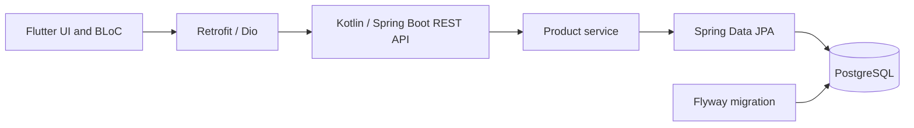

# Inventory Playground

A learning prototype connecting a **Kotlin/Spring Boot backend**, **PostgreSQL**, and a **Flutter frontend** around a product inventory workflow.

This repository supports my move from maintaining a commercial Access POS to learning and applying a modern backend/frontend stack. The broader ERP/POS product is still being explored; this repository is a development playground, not a production-ready ERP.

## What is implemented in the source

- Product creation, listing, updates, and deletion through a REST API.
- Search and pagination, with a Flutter client using BLoC and a Retrofit/Dio API layer.
- Request validation and separate request/response DTOs.
- PostgreSQL persistence through Spring Data JPA, with a Flyway migration.
- Decimal-based prices and version-based update checks using JPA `@Version`.
- Structured API error responses and request-correlation logging.
- Docker Compose configuration for the backend and database.

These statements describe the checked-in code. They are not a claim that every feature is fully tested or ready for production.

## Architecture



The prototype currently has a single Spring Boot backend. A broader microservice architecture is an exploration goal, not a feature claimed for this repository.

## Code worth reading

| Concern | Source |
|---|---|
| API routes | [ProductController.kt](backend/src/main/kotlin/com/inventory/playground/product/ProductController.kt) |
| Business logic and update checks | [ProductService.kt](backend/src/main/kotlin/com/inventory/playground/product/ProductService.kt) |
| Input validation | [ProductDtos.kt](backend/src/main/kotlin/com/inventory/playground/product/ProductDtos.kt) |
| Persistence and version field | [ProductEntity.kt](backend/src/main/kotlin/com/inventory/playground/product/ProductEntity.kt) |
| API error responses | [GlobalExceptionHandler.kt](backend/src/main/kotlin/com/inventory/playground/common/error/GlobalExceptionHandler.kt) |
| Client state and search | [product_bloc.dart](frontend/lib/features/product/bloc/product_bloc.dart) |
| Client API contract | [product_api.dart](frontend/lib/features/product/product_api.dart) |

## Local setup

Requirements: Docker with Compose; Flutter matching [frontend/pubspec.yaml](frontend/pubspec.yaml) and the tooling for your target platform. The backend Dockerfile supplies Java 25. Building outside Docker requires a matching JDK.

From the repository root:

```sh
docker compose up --build
```

The backend is configured on port **8080**; PostgreSQL is exposed locally on **5433**. Compose creates a persistent database volume. Its bundled credentials and logging settings are for local development, not public hosting.

In a second terminal:

```sh
cd frontend
flutter pub get
flutter devices
flutter run --dart-define=API_BASE_URL=http://localhost:8080/api
```

Select a configured desktop target when prompted. For the standard Android emulator, use `http://10.0.2.2:8080/api` instead; for a physical device, use a reachable development-machine address. Browser targets may need backend CORS configuration.

If generated model/API files need regeneration:

```sh
dart run build_runner build --delete-conflicting-outputs
```

The setup instructions follow the repository configuration; a fresh end-to-end run was not performed as part of this documentation update.

## Product API

| Method | Route | Purpose |
|---|---|---|
| GET | `/api/products?q=&page=0&size=10` | Search/list products |
| POST | `/api/products` | Create a product |
| PATCH | `/api/products` | Update a product; request includes its ID and version |
| DELETE | `/api/products/{id}` | Delete a product |

## Current limits and next work

Authentication/authorization, a complete ERP workflow, and comprehensive regression coverage remain future work. The checked-in backend test currently checks application-context loading; there is no claimed passing build badge or coverage percentage.

Useful next checks are product validation, duplicate SKUs, stale-version updates, search/pagination behavior, and frontend handling of API errors. [LEARNING.md](LEARNING.md) tracks the broader learning roadmap; its checklist may lag behind newer source changes.

## Related work

[Commercial Access POS case study](https://github.com/Amir-Merchad/Amir-Merchad/blob/main/docs/pos-case-study.md) · [Amir Merchad](https://github.com/Amir-Merchad)
